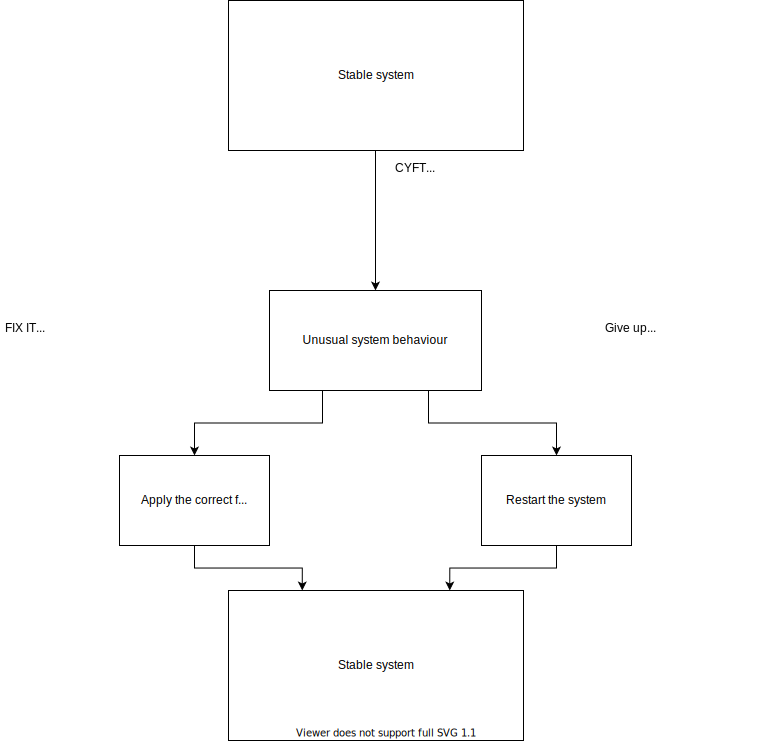

# Welcome to CYFT!

Hi! **CYFT** is a set of beginner (semi) friendly exercises that will run your system into a few problems that you might (will) face on a day-to-day basis. Your mission should you choose to accept it, is to figure out what these convoluted shell scripts did to mess with your system, and try to fix it :))

- There is no backup mechanism, use these at your own risk.
	> No critical changes will be made to the system that can not be reverted by a couple of web searches

## How does it work?

